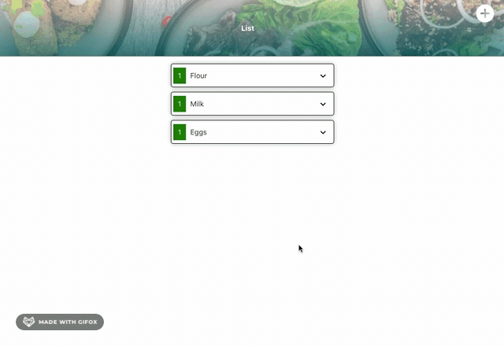

# Shopping List App

Created a simple shopping list app to update in real-time when an item was checked off the list.

## Motivation

My girlfriend and I always go to the store and try to make the most efficient use of our time.  By setting up the app with socket.io we are able to keep track of which items have already been gotten and avoid accidentally picking something up twice.

## Challenges and Solutions

-   Realtime updates to items being checked off the list:
    -   First introduction into using websockets with socket.io.  I was able to use the documentation to set up sockets to update the data.
-   Create a more fluid display of components to be more visually appealing:
    -   Using styled components I was able to figure out how to use props to update display of data using transitions and animation to give the app a more appealing look.
-   Notification system:
    -   With conditional rendering I was able to display a notification icon whenever there are additional notes available.

## Screenshots

## Tech/framework used

-   React.js
-   Styled Components
-   Node.js
-   Express.js
-   MongoDB
-   Socket.io

## Features

-   Allows users to check off items in realtime to help avoid duplication.  
-   Notes feature to allow additional information such as sales on item or certain brands to avoid.
-   Notes notification, will notify a user about notes that are attached to the item.

## Future Goals

-   In the future, I hope to implement:
    -   Implement individual accounts
    -   Provide save item feature to keep track of aisle location or previous cost 
    -   True authentication
